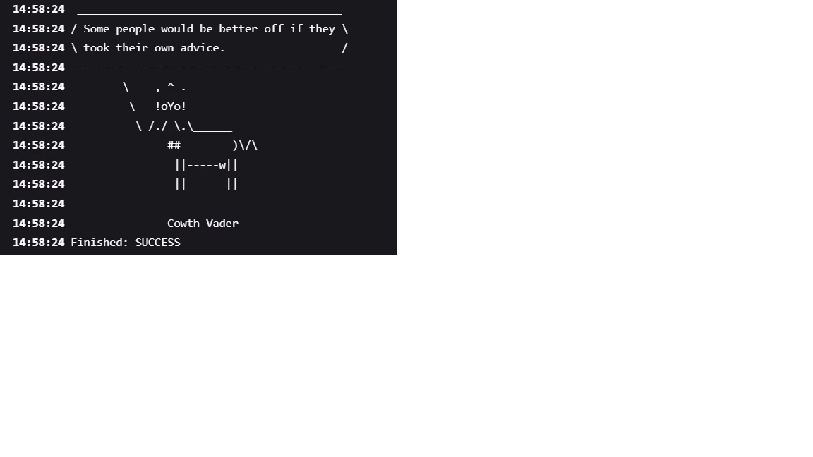

# Jenkins-Cowsay-freestyle
Generate ASCII artwork using Cowsay library and AdviceSlip Rest API

* Step-by-step Jenkins configuration guide
* Explanation of the shell script
* Output screenshot inclusion
* Formatting for clarity and professional presentation

---

```markdown
# 🐄 ASCII Artwork Generator using Jenkins, Cowsay, and AdviceSlip API

This project demonstrates how to create a **Jenkins Freestyle Project** that:
- Fetches random advice from the [AdviceSlip REST API](https://api.adviceslip.com/),
- Formats it as ASCII artwork using the **cowsay** utility.

> ✅ Ideal for DevOps beginners learning Jenkins automation and REST API integration.

---

## 📋 Jenkins Job Setup Instructions

### 1. Create a Freestyle Project
- Open Jenkins dashboard.
- Click on **New Item**.
- Enter item name: `Generate ASCII Artwork`.
- Select **Freestyle project**, click OK.

---

### 2. Configure the Jenkins Job

#### 📁 General
- Add a description:
```

Generate ASCII artwork using the cowsay library and the AdviceSlip REST API.

````

#### 📦 Source Code Management (SCM)
- Leave as **None**, unless you want to connect to a GitHub repo.

#### ⏰ Build Triggers
- Leave unconfigured (or choose based on your needs).

#### 🌍 Build Environment
- ✅ Enable: **Add timestamps to the Console Output**  
_(Requires Timestamp plugin)_

---

## 🔨 Build Step

### ➕ Add Build Step:
- Choose **Execute Shell**

### 🧾 Paste the Following Script:

```bash
#!/bin/bash
# Fetch advice
curl -s https://api.adviceslip.com/advice > advice.json
cat advice.json | jq -r '.slip.advice' > advice.message

# Check if advice has more than 5 words
if [ $(wc -w < advice.message) -gt 5 ]; then
  echo "Advice has more than 5 words"
else
  echo "Advice - $(cat advice.message) has 5 words or less"
fi

# Export full PATH for cowsay
export PATH="$PATH:/usr/games:/usr/local/games:/snap/bin"

# Install cowsay if not installed
if ! command -v cowsay &> /dev/null; then
  sudo /usr/bin/apt-get install cowsay -y
fi

# Display the advice with a random cow
cat advice.message | cowsay -f $(ls /usr/share/cowsay/tux | shuf -n 1)
````

---

## 💡 Script Breakdown

| Line                   | Description                                              |
| ---------------------- | -------------------------------------------------------- |
| `curl -s...`           | Fetches random advice in JSON format.                    |
| `jq -r...`             | Extracts the "advice" field from the JSON response.      |
| `wc -w`                | Word count check: Ensures advice has more than 5 words.  |
| `export PATH...`       | Ensures Jenkins can locate cowsay in system PATH.        |
| `command -v cowsay...` | Installs `cowsay` if it isn't already present.           |
| `cowsay -f`            | Displays the advice using a randomly selected ASCII cow. |

---

## 🖥️ Output Screenshot

Here is an example of the output displayed in the Jenkins console:



---

## ✅ Final Step

Click **Build Now** in Jenkins and watch your job produce ASCII magic!

---

## 📦 Requirements

* Jenkins installed and running
* Internet access on Jenkins machine
* `curl`, `jq`, and `cowsay` utilities (script will auto-install cowsay)

---

## 📚 Reference

* [AdviceSlip API](https://api.adviceslip.com/)
* [Cowsay](https://en.wikipedia.org/wiki/Cowsay)
* [Jenkins Documentation](https://www.jenkins.io/doc/)

---

## 🙌 License

This project is for educational purposes. Feel free to clone, modify, and enjoy ASCII cows!

```


